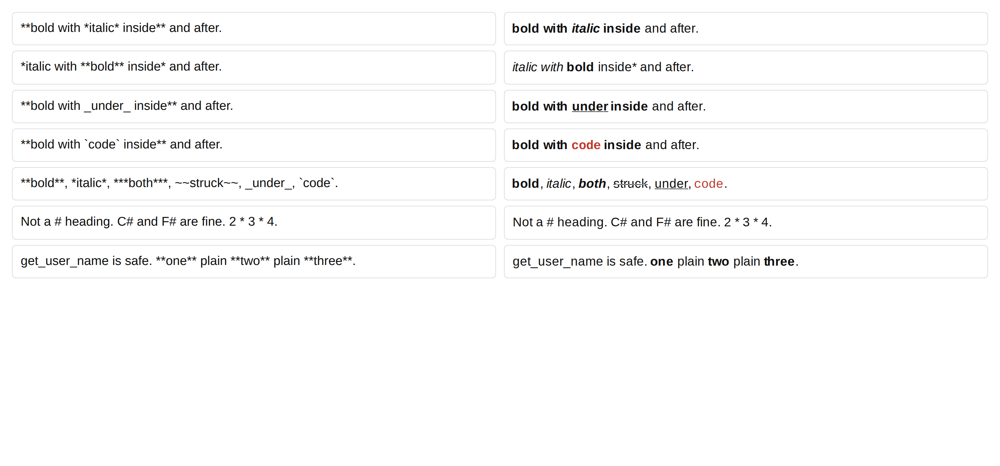

# gramfont

Write a grammar. Get a font that renders it.

```
$ gramfont examples/markdown.gram --base LiberationSans-Regular.ttf -o markfont.ttf
markfont.ttf 554 KB, markfont.woff2 110 KB
```

Set that font on a plain `<div>` of Markdown source and the Markdown renders.
No script, no stylesheet, no parser. The shaper does it, because the rules are
`GSUB` substitutions inside the font file.




The second picture is eight lines of grammar:

```
alphabet = " ...A-Za-z+-@";
markers  = "";

style added   = color "#1a7f37";
style removed = color "#cf222e";
style hunk    = from "LiberationSans-Bold.ttf", color "#8250df";

added   = line_start , "+" , { any } -> added keep;
removed = line_start , "-" , { any } -> removed keep;
header  = line_start , "@@" , { any } -> hunk keep;
```

## Toggles, which is most of what markup is

A closing `**` does not have to be matched with the `**` that opened it. It
turns bold off because bold was on. That makes emphasis a set of independent
flags rather than a bracket, and tracking k flags is a state machine with
`2**k` states and no memory of how it got there.

```
toggle bold   = "**" -> bold;
toggle italic = "*"  -> italic;
toggle code   = "`"  -> mono, color "#c0392b";
toggle under  = "_"  -> rule -0.11 unless preceded_by word;
```

Each toggle names attributes, and a `face` line supplies the file for each
combination of the face attributes:

```
face                  = "LiberationSans-Regular.ttf";
face bold             = "LiberationSans-Bold.ttf";
face italic           = "LiberationSans-Italic.ttf";
face bold italic      = "LiberationSans-BoldItalic.ttf";
face mono             = "LiberationMono-Regular.ttf";
...
```

The state lives in the glyph stream. Every glyph carries the state it is in
as part of its name, a delimiter is replaced by a zero-width glyph carrying
the state after the flip, and one lookup walking left to right reads its own
output as backtrack. Depth is not tracked because depth does not matter:
`*a **b ~~c `d` e~~ f** g*` comes out right, and so would twenty more levels.

Five toggles is 32 states. With headings and all of Latin-1 that is 110 KB of
woff2, and six toggles is the cap because every state holds a copy of the
whole alphabet.

An opener needs a non-space after it and a closer needs a non-space before
it, which is what leaves `2 * 3 * 4` alone. `unless preceded_by word` is what
leaves `get_user_name` alone.

## What a font cannot parse

A `GSUB` feature is a fixed list of lookups. Each lookup is a finite-state
transducer over the glyph buffer, and composing finite-state transducers
gives you another finite-state transducer. So one shaping pass of a fixed
font is a regular transduction, whatever the buffer does in the middle.

That is a lower bar than it sounds, because most markup is regular. Toggles
are. What is not regular is anything that has to match a specific opener with
a specific closer: balanced parentheses, a nesting depth that changes the
output, a construct whose meaning depends on how deep it is. For those you
either unroll to a fixed depth or you do not do it in a font.

`gramfont` takes EBNF syntax for the span rules and refuses the productions
that leave the regular subset, naming the cycle:

```
$ gramfont nested.gram --check --base Regular.ttf
nested.gram: nested is defined in terms of itself (nested -> nested). A font
runs a fixed list of substitutions, so it can match regular patterns and
nothing deeper; recursion needs a stack it does not have. Unroll it to a
fixed depth, or drop the nesting.
```

`combine a , b = c;` is the unrolled version for span rules, one level per
declaration. It exists for markup that really is bracketed. For markup that
toggles, use toggles and the depth stops being a question.

## The language

| statement | what it does |
|---|---|
| `alphabet = "a-z0-9 *";` | the characters the font covers; `-` makes a range |
| `markers = "*_";` | which of them are syntax rather than text |
| `style NAME = ...;` | how a match is drawn |
| `NAME = expr;` | a named production, for reuse |
| `NAME = expr -> STYLE;` | a rule: match this, draw it that way |
| `combine A , B = C;` | B nested inside A renders as C |
| `face <attrs> = "f.ttf";` | the file for one combination of face attributes |
| `toggle NAME = "**" -> attrs;` | a delimiter that flips a flag on and off |

Expressions are EBNF: `"literal"`, `name`, `a , b`, `a | b`, `[ optional ]`,
`{ repeated }`, `( grouped )`. The builtin classes are `any`, `letter`,
`digit`, `word`, `space`, `nonspace`, `punct`, and they never contain a marker
character. `line_start` anchors a rule to the start of a line.

Style properties are `from "some.ttf"` (take the outlines from another font),
`scale 1.5`, `color "#c0392b"`, and `rule -0.11` (a bar at that height in em,
which is how underline and strikethrough are drawn).

Two modifiers:

- `unless starts_with <class>` and `unless preceded_by <class>` narrow where a
  rule fires. These are what keep `2 * 3` and `get_user_name` intact.
- `keep` after the style leaves the delimiters visible and styles them too. A
  diff's `+` is part of the line; a Markdown `**` is not.

## How the rules come out

A span rule like `"**" , { any } , "**" -> bold` compiles to two
substitutions. The first styles the glyph directly after the opening marker.
The second matches "a styled glyph followed by a plain one" and styles that
too. A lookup walks the buffer left to right and sees its own output as
backtrack, so the second rule carries the style to the end of the run on its
own. The run stops where the class stops matching, and the closing marker is
outside every class because it is a marker.

Marker characters are then substituted for a zero-width glyph, but only where a
styled glyph ended up next to them. A delimiter that styled nothing stays on
the page, which is the whole reason `C#` and `2 * 3 * 4` survive.

Colour is `COLR`/`CPAL`. A `COLR` base glyph cannot be its own layer, so the
outline moves to a duplicate and the glyph the text uses becomes an empty shell
painted from the palette.

## Install

Python 3.8+ and `fonttools`. Nothing else.

```
pip install fonttools
python -m gramfont.cli examples/markdown.gram --base /path/to/Regular.ttf
```

`--check` validates a grammar and stops.

## Tests

```
python -m unittest discover -s tests
```
