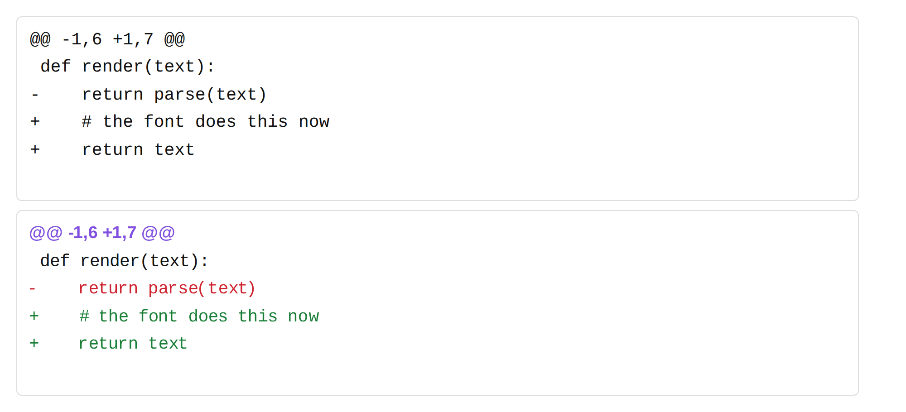

# gramfont

Write a grammar. Get a font that renders it.

```
$ gramfont examples/markdown.gram --base LiberationSans-Regular.ttf -o markfont.ttf
markfont.ttf 82 KB, markfont.woff2 34 KB
```

Set that font on a plain `<div>` of Markdown source and the Markdown renders.
No script, no stylesheet, no parser. The shaper does it, because the rules are
`GSUB` substitutions inside the font file.



That picture is eight lines of grammar:

```
alphabet = " ...A-Za-z+-@";
markers  = "";

style added   = color "#1a7f37";
style removed = color "#cf222e";
style hunk    = from "LiberationSans-Bold.ttf", color "#8250df";

added   = line_start , "+" , { any } -> added keep;
removed = line_start , "-" , { any } -> removed keep;
header  = line_start , "@@" , { any } -> hunk keep;
```

## What a font can and cannot parse

A `GSUB` feature is a fixed list of lookups. Each lookup is a finite-state
transducer over the glyph buffer, and composing finite-state transducers gives
you another finite-state transducer. So a font recognises exactly the regular
languages.

EBNF describes context-free languages. The two are not the same set, and the
gap is the interesting part: anything needing a stack is outside it. Arbitrary
nesting, balanced delimiters, matched parentheses. `gramfont` takes EBNF syntax
and refuses the productions that leave the regular subset, naming the cycle:

```
$ gramfont nested.gram --check --base Regular.ttf
nested.gram: nested is defined in terms of itself (nested -> nested). A font
runs a fixed list of substitutions, so it can match regular patterns and
nothing deeper; recursion needs a stack it does not have. Unroll it to a fixed
depth, or drop the nesting.
```

Bounded nesting is fine, because it unrolls, and `combine` is how you ask for
a level of it:

```
combine bold , italic = bolditalic;
```

That says italic inside bold renders as `bolditalic`, and the compiler emits a
second copy of the italic rules that reads bold-styled glyphs and writes
bolditalic ones. `**bold with *italic* inside**` then comes out right, markers
and all. Each `combine` is one more level, written out at compile time. What
you cannot write is "to any depth", and that is the boundary rather than a
missing feature.

Nesting runs one way. A rule's lookup fires either before the rule it nests
inside or after it, and a font cannot pick per occurrence, so `combine a , b`
and `combine b , a` together are refused: one of the two orders would render
wrong every time. In the Markdown example bold holds italic, and the reverse,
`*italic with **bold** inside*`, is the case it does not handle.

## The language

| statement | what it does |
|---|---|
| `alphabet = "a-z0-9 *";` | the characters the font covers; `-` makes a range |
| `markers = "*_";` | which of them are syntax rather than text |
| `style NAME = ...;` | how a match is drawn |
| `NAME = expr;` | a named production, for reuse |
| `NAME = expr -> STYLE;` | a rule: match this, draw it that way |
| `combine A , B = C;` | B nested inside A renders as C |

Expressions are EBNF: `"literal"`, `name`, `a , b`, `a | b`, `[ optional ]`,
`{ repeated }`, `( grouped )`. The builtin classes are `any`, `letter`,
`digit`, `word`, `space`, `nonspace`, `punct`, and they never contain a marker
character. `line_start` anchors a rule to the start of a line.

Style properties are `from "some.ttf"` (take the outlines from another font),
`scale 1.5`, `color "#c0392b"`, and `rule -0.11` (a bar at that height in em,
which is how underline and strikethrough are drawn).

Two modifiers:

- `unless starts_with <class>` and `unless preceded_by <class>` narrow where a
  rule fires. These are what keep `2 * 3` and `get_user_name` intact.
- `keep` after the style leaves the delimiters visible and styles them too. A
  diff's `+` is part of the line; a Markdown `**` is not.

## How the rules come out

A span rule like `"**" , { any } , "**" -> bold` compiles to two
substitutions. The first styles the glyph directly after the opening marker.
The second matches "a styled glyph followed by a plain one" and styles that
too. A lookup walks the buffer left to right and sees its own output as
backtrack, so the second rule carries the style to the end of the run on its
own. The run stops where the class stops matching, and the closing marker is
outside every class because it is a marker.

Marker characters are then substituted for a zero-width glyph, but only where a
styled glyph ended up next to them. A delimiter that styled nothing stays on
the page, which is the whole reason `C#` and `2 * 3 * 4` survive.

Colour is `COLR`/`CPAL`. A `COLR` base glyph cannot be its own layer, so the
outline moves to a duplicate and the glyph the text uses becomes an empty shell
painted from the palette.

## Install

Python 3.8+ and `fonttools`. Nothing else.

```
pip install fonttools
python -m gramfont.cli examples/markdown.gram --base /path/to/Regular.ttf
```

`--check` validates a grammar and stops.

## Tests

```
python -m unittest discover -s tests
```
